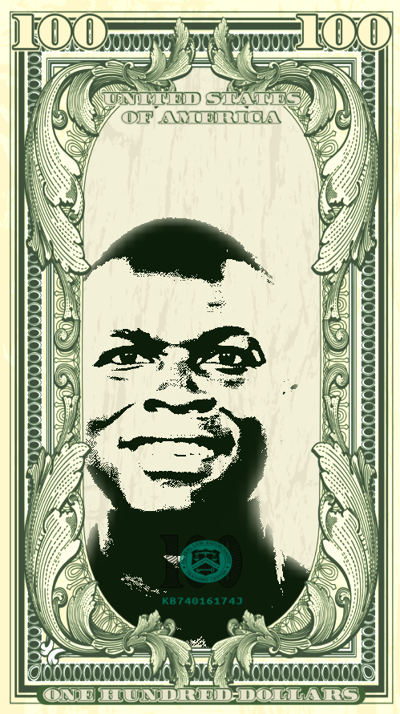
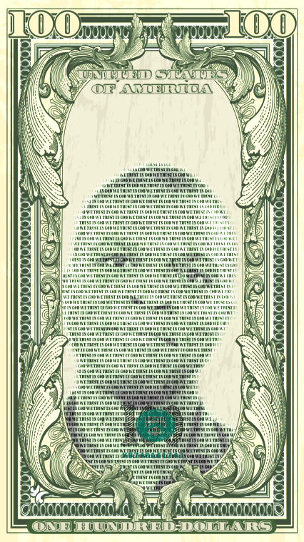

Dollar Bill Spark AR Filter
========================

Dollar bill filter made using Adobe Photoshop and Spark AR.

There are two filters, the main filter:

Made by constructing a high contrast black and white LUT on photoshop, applying it to a texture containing the video feed, and then setting the alpha to 1 in the black regions, and 0 elsewhere.

and the alternate one:

Made my making the image black and white, then overlaying a text pattern using add and multiply, then adding a bit of a green tint to it.

*External Resources Used:*

- 
- 
- 
- A couple of shutterstock photos
